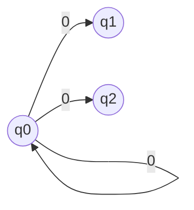

# 形式语言与自动机

## 字母表

**注意区分$\epsilon$ 和 $\varnothing$**

* $\epsilon$ 是一个长度为0的句子
* $\varnothing$ 是空集

## 乔姆斯基文法体系

### 0型文法

即文法 $ G(V,T,P,S)$  称为 **短语结构文法(PSG)**

### 1型文法

对于0型文法G有
$$
\forall \alpha \to \beta \in P, \quad |\beta| \geq |\alpha|
$$
称为1型文法或 **上下文有关文法(CSG)** 

### 2型文法

对于1型文法G有
$$
\forall \alpha \to \beta \in P, \quad |\beta| \geq |\alpha| 并且 \alpha \in V
$$
称为2型文法或 **上下文无关文法(CFG)** 

### 3型文法

对于2型文法G
$$
\forall \alpha \to \beta \in P, \quad \alpha \to \beta 具有形式\\
A \to w\\
A \to wA
$$
其中 $w \in T^+$ 

称为3型文法或 **正则文法 (RG)** 

| 文法类型        | $\forall \alpha \to \beta$                 |
| --------------- | ------------------------------------------ |
| 0（短语结构）   | 无限制                                     |
| 1（上下文有关） | $|\beta| \geq |\alpha|$                    |
| 2（上下文无关） | $|\beta|\geq |\alpha|$ 并且 $\alpha \in V$ |
| 3（正则）       | $A \to w\\A \to wA$                        |

从上到下是包含关系

### 正则文法最简形式

**定理**：L是RL**充要条件**是存在文法，其产生式要么形如 $A \to a$ 要么形如 $A \to aB$ 

### 线性文法

$\forall \alpha \to \beta \in P$ 均具有形式

* $A \to w$ 
* $A \to wBx$ 

其中 $w, x \in T^*$ 

#### 右线性文法

$\forall \alpha \to \beta \in P$ 均具有形式

* $A \to w$ 
* $A \to wB$ 

其中 $w, x \in T^*$ 

#### 左线性文法

$\forall \alpha \to \beta \in P$ 均具有形式

* $A \to w$ 
* $A \to Bw$ 

其中 $w, x \in T^*$ 

**定理**：左线性文法充要条件：其产生式要么形如 $A \to a$ 要么形如 $A \to Ba$ 

**定理**：左线性文法与右线性文法等价

## 语言识别

### 回溯

遍历所有的推导

### 有限自动机

$$
M = (Q, \Sigma, \delta, q_0, F)
$$

* $Q$ 状态集合
* $\Sigma$ 输入字母表
* $\delta$ 状态转移函数
* $q_0$ 开始状态
* $F$ 终止状态

#### DFA

每个输入字符有确定的状态转移

#### 即时描述

$\delta (q_0, x) = q$ 那么 $xqy$ 称为一个即时描述，表示 xy是正在处理的字符串，当前到达状态q，M正准备处理y的第一个字符

$\alpha \vdash_M^n \beta$ 表示从即时描述 $\alpha$ 移动n次到达即时描述 $\beta$ ，上标同样可以使用 *、+

如果 xqay 是M的一个即时描述，且 $\delta (q, a) = p$ 那么 $xqay \vdash_M xapy$ 

**定义** ：状态的字符串集合：从初始状态能引导状态机到达状态的字符串集合
$$
\text{set}(q) = \{x|x\in \Sigma^*, \delta(q_0, x)=q\}
$$
**定义**：$R_M$ 等价关系：
$$
\forall x,y \in \Sigma^*, xR_My \Leftrightarrow \exists q \in Q \quad s.t.\\
x \in \text{set}(q) \quad \text{and} \quad y \in \text{set}(q)
$$
上述是等价关系，能够将 $\Sigma^*$ 分成不多于 $|Q|$ 个等价类

#### NFA

与DFA等价

##### 从NFA到DFA

#### 带空移动的NFA

$\epsilon$ 闭包
$$
\epsilon-\text{CLOSURE}(q) = \{p|从q到p有一条标记为\epsilon的路径\}
$$
对状态集合同样也有闭包概念
$$
\hat \delta (q,a) = \hat \delta (a,\epsilon a) = \epsilon-\text{CLOSURE}(P)\\
P =\{p|\exists r \in \hat\delta(q, \epsilon) s.t. p \in \delta(r,a\} \\
= \bigcup_{r\in \hat \delta(q,\epsilon)} \delta(r,a)
$$

##### 由带空移动的NFA构造等价NFA

取NFA $M_2 = (Q, \Sigma, \delta_2, q_0, F_2)$ 其中
$$
F_2 \left\{
\begin{align}
&F \cup \{q_0\} \quad &\text{如果} F\cap \epsilon-\text{CLOSURE}(q_0)\neq 0\\
&F \quad &\text{如果} F\cap \epsilon-\text{CLOSURE}(q_0)= 0
\end{align} 
\right.
$$
对于 $\forall (q,a) \in Q \times \Sigma$ 使 $\delta_2(q,a) = \hat \delta_1(q,a)$

其实就是，写出 $\hat \delta$ 的表，把空移动去除，按照表中集合连线，再按照上述步骤判断一下终止状态都有哪些。

如 

$q_0$ 的 0移动有 $q_0, q_1, q_2$ ，那么局部的NFA有

其余状态同理。

### FA接收的语言是RG

#### DFA转RG

构造方法
$$
P = \{q \to ap | \delta (q,a) = p\} \cup \{q \to a | \delta (q,a) = p\in F\}
$$
例如：

#### RG转DFA

每个变量看成一个状态，

* 如果派生为 $A \to wB$ 的形式，那么DFA就为 `A --w--> B` 的形式。
* 如果派生为 $A \to w$ 的形式，那么DFA就为 `A --w--> Z` 的形式，其中Z代表终止状态。

可以用下式表示 
$$
\delta(A,a) = \left\{
\begin{align}
&\{B|A \to aB \in P\}\cup\{Z\} \quad &\text{if } A \to a \in P \\ \\
&\{B|A \to aB \in P\} \quad &\text{if } A \to a \notin P
\end{align}
\right.
$$

#### 左线性文法转DFA

左线性文法 $G(V,T,P,S)$ 无空串

* FA为 $M=(V\cup\{Z\}, T,\delta,Z,\{S\})$ 此处Z为初始状态 
*  $\forall (a,B) \in T\times V$
  * 如果 $A \to Ba \in P$ 那么 $\delta (B,a)=A$
  * 如果 $A \to a \in P$ 那么 $\delta (Z,a)=A$

#### DFA转左线性文法

1. 预处理DFA

   1. 删除陷阱状态
   2. 图中添加Z作为文法开始变量
   3. 复制一条原本到达终止状态的弧，使其从原本状态出发到Z

2. 构造文法

   * 如果 $\delta (A,a)  = B$ 则有 $B \to Aa$

   * 如果 $\delta (A,a) = B$ 且A是开始状态，则有 $B \to a$

### FA的变形

#### 2DFA

$$
M = (Q,\Sigma,\delta,q_0,F)
$$

* $\delta: \ Q\times \Sigma \to Q \times \{L,R,S\}$

#### 2NFA

类似2DFA

#### Moore机

六元组
$$
M = (Q,\Sigma,\Delta,\delta,\lambda,q_0)
$$
$\Delta$ 输出字母表

$\lambda: Q \to \Delta$ 输出函数 ，状态 $q$ 输出对应字符

#### Mealy机

六元组
$$
M = (Q,\Sigma,\Delta,\delta,\lambda,q_0)
$$
$\Delta$ 输出字母表

$\lambda: Q\times \Sigma \to \Delta$ 输出函数 ，$\lambda(q,a)=d$ 表示在状态 q 读入字符 a，输出字符d

**Moore机和Mealy机等价**

## 正则表达式

**优先级**：闭包>乘>加

### 运算律

* 结合律
* 分配律：$r(s+t) = rs+rt$
* 交换律：$r+s = s+r$
* 幂等律：$r+r=r$
* 零元素与空元素
  * $r+\varnothing = r$
  * $r\epsilon = \epsilon r = r$
  * $r\varnothing = \varnothing r = \varnothing$关于这点和上一点，看二者的[定义](#字母表) ，结合**分配律**理解 
  * $L(\varnothing) = \varnothing$ 
  * $L(\epsilon) = \{\epsilon\}$
  * $L(\varnothing^*) = \{\epsilon\}$ 因为 $L(\varnothing^0) = \{\epsilon\}$
  * $L((r^*s^*)^* = L((r+s)^*)$

### RE与FA等价

#### RE转NFA

基本的例子

根据以上例子，给出 $r=r_1+r_2;\quad r=r_1r_2;\quad r=r_1^*$ 构造方法

##### 加法构造

##### 乘法构造

##### 闭包构造

#### DFA转RE

1. 预处理

   * 给开始和终止加上X、Y状态
   * 去掉所有不可达状态

2. 对图操作

   * 并弧：将从q到p的标记为$r_1,r_2,\cdots,r_g$并⾏弧用从q到p的、标记为$r_1+r_2+\cdots +r_g$ 的弧取代这g个并⾏弧。

     

   * 去状态1：如果从q到p有⼀条标记为$r_1$的弧，从p到t有⼀条标记为$r_2$的弧，不存在从状态p到状态p的弧，将状态p和与之关联的这两条弧去掉，用⼀条从q到t 的标记为$r_1r_2$的弧代替。

     

   * 去状态2：如果从q到p有⼀条标记为$r_1$的弧，从p到t有⼀条标记为$r_2$的弧，从状态p 到状态p标记为$r_3$的弧，将状态p和与之关联的这三条弧去掉，用⼀条从q 到t的标记为$r_1r_3^ *r_2$的弧代替。

     

   * 去状态3：如果图中只有三个状态，⽽且不存在从标记为X的状态到达标记为Y的状 态的路，则将除标记为X的状态和标记为Y的状态之外的第3个状态及其相 关的弧全部删除。

3. 从标记为X的状态到标记为Y的状态的弧的标记为所求的正则表 达式。如果此弧不存在，则所求的正则表达式为 $\varnothing$ 

### 正则语言表示方法转化

## 正则语言的性质

### 泵引理

由于DFA中状态个数是有穷的， 所以在处理⼀个**足够长**的句⼦的过程中，**必定会重复**地经过某⼀个状态。

设L为RL，那么对应有DFA $M = (Q,\Sigma,\delta,q_0,F)$ 假设有N个状态。

那么 $z = a_1a_2\cdots a_m\quad m \geq N$ 由于一共N个状态，状态序列 $q_0,q_2,\cdots ,q_N$ 有N+1状态，会有两个状态重复。不妨假设 $q_k = q_j$ 
$$
\delta(q_0, a_1a_2\cdots a_k)=q_k \\
\delta(q_k, a_{k+1}\cdots a_j)=q_j = q_k \\
\delta(q_j, a_{j+1}\cdots a_m)=q_m \\

因此\quad \forall i \geq 0\\
\delta(q_k, (a_{k+1}\cdots a_j)^i) = q_j=q_k
$$
因此可以理解为 $a_1\cdots a_k (a_{k+1}\cdots a_j)^i a_{j+1}\cdots a_m \in L(M)$

设
$$
u= a_1a_2\cdots a_k\\
v = a_{k+1}\cdots a_j\\
w = a_{j+1}\cdots a_m
$$
那么 $uv^iw \in L$ 由于 $k<j\leq N$ 所以 $|uv| = j \leq N, \ |v|\geq 1$

**引理(泵引理)**

L为RL，则存在**仅依赖于L的正整数N** $\forall z \in L$ 如果 $|z|\geq N$ 则存在u、v、w满足

1. z = uvw
2. $|uv| \leq N$
3. $|v|\geq 1$
4. 对于任意整数 $i \geq 0 \quad uv^iw \in L$ 
5. N不大于接受L的最小DFA的状态数。

#### 利用泵引理证明一个语言不是RL

1. 首先假设该语言是RL，则其应该满足泵引理，选任意的N.
2. 找到一个语言中的句子$z=L(|z|\geq N)$.
3. 任选满足z=uvw，其中$|v| \geq 1$，且$|uv|\leq N$的u,v,w
4. 找到一个$i\geq 0$，证明使$uv^iw\notin L$.
5. 推出矛盾说明该语言不满足泵引理，从而说明该语言不是RL。

>  泵引理用来证明一个语言不是RL
>
> 不能用泵引理去证明一个语言是RL

### 正则语言的封闭性

**定理**：RL在并、乘积、闭包运算下是封闭的

**定理**：RL 在补运算下是封闭的。

DFA $M'=(Q,\Sigma, \delta, q_0, Q-F)$ 对应着正则语言的补集

**定理**：RL 在交运算下是封闭的。

#### 正则代换

$\Sigma\quad \Delta$ 是两个字母表，映射 $f:\Sigma \to 2^{\Delta^*}$ 称为是代换，如果 $\forall a \in \Sigma \quad f(a)$是$\Delta$ 上的RL，那么称为正则代换。

先将f定义域扩展到 $\Sigma^*$ 上

* $f(\epsilon) = \{\epsilon\}$
* $f(xa) = f(x)f(a)$ 

再扩展到 $2^{\Sigma^*}$ 

* $f(L) = \bigcup_{x\in L} f(x)$

**定理**：L是Σ上的RL，那么正则代换f满足 $f(L)$ 也是RL

**定义**：对于字母表$\Sigma$和$\Delta$，$f: \Sigma \to \Delta^*$ 如果 $\forall x, y \in\Sigma^*\quad f(xy) = f(x)f(y)$ 则称为**同态映射**

L的**同态像**：
$$
\forall L \subset \Sigma^*\quad f(L) = \bigcup_{x\in L}f(x)
$$
$\forall w \in \Delta^* \quad \forall L \subset \Delta^*$ 同态原像是一个集合

**定义**：商 $L_1/L_2 = \{x|\exists y \in L_2 \quad s.t.\  xy\in L_1\}$

主要用来考虑句子后缀

### Myhill-Nerode

[等价关系](#即时描述) 同样表述为 $xR_M y \Leftrightarrow \delta(q_0,x) = \delta(q_0,y)$

**语言确定的等价关系**： $xR_L y \Leftrightarrow (\forall x \in \Sigma^*, xz\in L \Leftrightarrow yz \in L)$；x,y后不管接什么串z，要么都是L的句子，要么都不是 

**右不变的等价关系**：如果 $x\ R\ y$ 那么 $\forall z \in \Sigma^*$ 必有 $xz\ R\ yz$

$R_M$ 和 $R_L$ 都是右不变的。

R是 $\Sigma^*$ 上的等价关系， $\Sigma^* / R$ 表示等价关系分开的集合数量，称为$R$关于 $\Sigma^*$ 的**指数**

$R_M$ 的分割更细致，因此称 $R_M$ 是 $R_{L(M)}$ 的**加细**

**Myhill-Nerode定理**：如下三个命题等价

1. L是RL
2. L是$\Sigma^*$ 上某一个具有有穷指数的右不变等价关系R的某些等价类的并
3. $R_L$ 具有有穷指数

证明该语言不是RL最方便的方法就是证明$R_L$的指数是无穷的

**例**：

证明 $\{0^n1^n|n\geq 0\}$不是RL

### 极小化DFA

 算法步骤

1. 标记终止状态和其余非终止状态可区分

2. 从第一个状态开始迭代标注它与其余状态是否可区分：
   1.  如果状态对转移后的关联状态对可区分，那么该状态对可区分
   2. 如果关联状态对没有被标注，那么将该关联状态加入关联状态链表（基于一个双向链表实现）（对状态列表的保存有冗余设计，每次向前添加时，实际会新建链表，即如果有一链表 q0->q3->q2，那么 q3->q2，q0->q3->q2都会被保存）
   3. 如果迭代到的状态对被标记，那么寻找以该状态对开始关联列表，并将关联列表上之后的状态都标记上

3. 上述步骤会标记完成可区分状态表，接着合并不可区分状态，将不可区分的状态放入一个集合中：
   1. 遍历可区分状态表中的所有状态对
   2. 如果两状态对不可区分，那么遍历最终的不可区分状态
      1. 如果能在不可区分状态里找到某个集合包含状态对中的一个元素，那么将该状态对元素添加到这个集合中
      2. 如果不能，则从状态对元素新建一个集合，加入不可区分状态中。

4. 对于上述得到的新的可区分状态（每个可区分状态可能包含多个不可区分状态），逐个遍历其中的不可区分状态，得到最终针对新可区分状态的状态转移函数。

### 正则语言判定定理

**定理**：DFA $M=(Q, \Sigma, \delta, q_0,F)$ 对应语言为**非空**的充要条件是：
$$
\exists x \in \Sigma^*, \quad |x|<|Q|, \delta(q_0,x) \in F
$$
**定理**：DFA $M=(Q, \Sigma, \delta, q_0,F)$ 对应语言为**无穷**的充要条件是：
$$
\exists x \in \Sigma^*, \quad |Q|\leq|x|<2|Q|, \delta(q_0,x) \in F
$$
*可以联系[泵引理](#泵引理)*

**定理**：设DFA $M_1=(Q_1,\Sigma,\delta_1,q_{01},F_1)$，DFA $M_2=(Q_2,\Sigma,\delta_2,q_{02},F_2)$，则存在判定M1与M2是否**等价**的算法。

**定理**：设L是字母表上的RL，对任意$x\in \Sigma^*$，存在判定x是不是L的句子的算法。

## 上下文无关语言

[定义](#2型文法)

派生树：

顶点的**顺序**：V1，V2是派生树T的两个不同顶点，如果存在顶点v，v至少有两个儿子，使得v，是v的较左儿子的后代，v，是v的较右儿子的后代，则顶点v在顶点v2的左边，顶点v2在顶点v，的右边。

派生树的**结果**：

* 派生树T的所有叶子顶点从左到右依次标记为X1，X2，…，X，则称符号串X1X2.…Xn是T的结果。
* 句型a的派生树：“结果为a的派生树”。·派生树的结果可以是句子，也可以是句型
* 一个文法可以有多棵派生树，它们可以有不同的结果。

设CFG $G=(V，T，P，S)$，$S\Rightarrow^* \alpha$的充分必要条件为G有一棵结果为$ \alpha$的派生树。

定义：

* **最左派生**：$\alpha$的派生过程中，每一步都是对当前句型的最左变量进行替换
* **左句型**：最左派生得到的句型可叫做左句型。
* **最右归约**：与最左派生相对的归约叫做最右归约。

定义：

* **最右派生**：$\alpha$的派生过程中，每一步都是对当前句型的最右变量进行替换
* **右句型**：最右派生得到的句型可叫做右句型。
* **最左归约**：与最左派生相对的归约叫做最左归约。

最右派生、右句型、最左归约又称为规范派生、规范句型、规范规约

#### 二义性

字符串对应两个及以上派生树，则文法有二义性

如果语言L不存在非二义性文法，则称L是固有二义性的，又称L是先天二义性的。

#### 无用符号

能出现字符串的派生过程中的有用，否则无用。

#### 删除无用符号

##### 删除派生不出终极符号行的变量

##### 删除不出现在任何句型中的语法符号

依次使用上述算法(先删派生不出终极符号行的变量，再删不出现在任何句型中的语法符号)就可删除无用符号

#### 空产生式

形如 $A\to \epsilon$ 

##### 求CFG G的可空变量集

##### 去除空产生式

1. 首先求可空变量集U
2. 构造 $P'$
   * $\forall A \to X_1X_2\cdots X_m \in P$ 将 $A\to \alpha_1\alpha_2\cdots \alpha_m$ 放入 $P'$ ， 如果$X_i \in U,\quad \alpha_i = X_i\text{ or }\epsilon$ ；如果 $X_i\notin U\quad \alpha_i = X_i$

#### 单一产生式

形如 $A \to B$ 

消除：用$B$ 的表达式直接代替$A \to B$ 中的B

* 如果 $A \to \alpha$ 不是单一产生式，就放入 $P_2$ 
* 如果 $A \to_G^+ B$ 且$B \to \alpha$ 不是 单一产生式，那么 $A \to \alpha$ 放$P_2$

#### CFG化简

流程

1. 删除无用符号；
2. 删除E-产生式；
3. 删除单一产生式；
4. 当删除单一产生式后，文法中再出现新的无用符号时，再次进行删除无用符号。

### CNF 乔姆斯基范式

形式都为 $A \to BC$ 或 $A \to a$

不允许有空产生式和单一产生式

#### 通过CFG构造CNF

1. 首先将化简后的CFG转化为都为 $A \to B_1B_2\cdots B_n$ 和 $A\to a$ 的形式

   > 对于 $A \to aB$ 这类转化为 $A \to A_aB \quad A_a \to a$

2. 将形如 $A \to A_1A_2\cdots A_n$  都替换为
   $$
   A \to A_1B_1 \\
   B_1 \to A_2B_2\\
   \cdots\\
   B_{n-2} \to A_{n-1}A_n
   $$
   

### GNF 格雷巴赫范式

有如下两种形式

* $A\to a$
* $A\to a A_1A_2\cdots A_m$

首先 $A \to \alpha B \beta$ 又 $B \to \gamma_1|\gamma_2|\cdots$ 那么可以将B替换为$\gamma$ 

#### 递归

如果存在 $A \Rightarrow^n \alpha A \beta$ 则称为递归派生；n>2 称为间接递归；$\alpha = \epsilon$ 称为左递归，反之为右递归

**引理**：对于
$$
\left\{
\begin{align}
A &\to A\alpha_1|A\alpha_2|A\alpha_3\cdots\\
A &\to \beta_1|\beta_2|\beta_3|\cdots
\end{align}
\right.
$$
可以替换为
$$
\left\{
\begin{align}
A &\to \beta_1|\beta_2|\beta_3|\cdots\\
A &\to \beta_1B|\beta_2B|\beta_3B|\cdots\\
B &\to \alpha_1|\alpha_2|\alpha_3|\cdots\\
B &\to \alpha_1B|\alpha_2B|\alpha_3B|\cdots
\end{align}
\right.
$$

#### CFG转GNF

1. 首先将产生式化成形式（通过引入变量替换终极符）
   $$
   A \to A_1A_2\ldots A_m\\
   A\to a A_1A_2\ldots A_{m-1} \\
   A \to a
   $$

2. 将产生式都转化为形式 
   $$
   A_i \to A_j \alpha\quad i < j\\
   A_i \to a \alpha\\
   B_i \to \alpha
   $$
   

   当出现j < i 的情况，就用 $A_i$ 的表达式替换，直到出现左递归:

   

3. 具有最大下标的A已经满足GNF的要求，将这些产生式带入还不满足要求的$A_2$产生式，使得$A_2$产生式都满足GNF的要求；之后递归的带入 $A_1$

## 下推自动机

CFG都可以化为GNF，最左派生是，句型中变量都以后缀形式出现。

使用下推自动机识别CFG
$$
M = (Q,\Sigma, \Gamma, \delta,q_0,Z_0, F)
$$

* Q状态集合
* $\Sigma$ 输入字母表
* $\Gamma$ 栈顶符号表
* $Z_0\in \Gamma$ 开始符号，启动时栈内唯一的符号
* $q_0$ 开始状态
* F终止状态
* $\delta$ 转移函数，$\delta: Q \times (\Sigma\cup \{\epsilon\} \times \Gamma) \to 2^{Q\times \Gamma^*}$ 

$$
\delta(q,a,Z) = \{(p_1, \gamma_1), (p_2, \gamma_2), \cdots\}
$$

表示状态q下，栈顶为Z，读入a，状态可以转移为$q_i$ 并且**弹出Z并将 $\gamma_i$ 从右至左压入栈**，读头移动，准备读入下一个字符。

特别的如果$a = \epsilon$ 那么读头不移动。

同样有 **即时描述**：$(q,w,\gamma)$ 当前状态q，未处理字符串w，栈内符号串$\gamma$ （最左侧为栈顶）

### 接收语言

两种接受方法：

* 转移到特定终态接收  记作$L(M)$
* 空栈接收（栈为空时接收）记作$N(M)$

### GNF转PDA

模拟最左派生，对于 $A \to b \alpha$，就是读入b，压栈$\alpha$
$$
\forall A \in V,\ a\in T,\ \gamma \in V^*\\
\delta(q,a,A) = \{(q,\gamma)|A\to a\gamma \in P\}
$$
对于含有空串的语言，再加入识别空串的 $\delta_1(q_0,\epsilon, Z) = \{(q_0, \epsilon), (q,S)\}$ 

类似的还可以终态接受

还可以直接**观察语言结构**来设计自动机，常用

### 终态接受的PDA转空栈接受PDA

状态加入初始状态和清栈状态，栈顶符号加入一个用于放在栈底的符号。

初始状态空移动转移到原PDA初始状态，并将新加的栈符号连同原PDA栈底符号压入栈底

之后所有的转移都模拟原PDA，直到原终止状态

原终止状态转移到请栈状态，开始通过空移动清栈。

### 空栈接受PDA转终态接受的PDA

加入终止状态和标志栈底的元素，等看到栈底元素后就进入终止状态。

### PDA转CFG

使用三元组 $[q,A,q_{next}]$ 表示CFG中变量，其中A是栈顶符号。

对于 $\delta(q,a,A) = (q_1,A_1A_2\cdots A_n)$ 我们不确定处理完$A_1$ 到 $A_n$ 后状态是什么，那么就遍历

流程：

以该题为例

1. 首先构造S的产生式 $S\to [q_0,Z,q_0]|[q_0,Z,q_1]|[q_0,Z,q_2]$

2. 对每个转移函数构造产生式

   

   

对于空串的处理 

## 上下文无关语言

### CFL的泵引理

$\forall z \in L $ 当 $|z| \geq N$ 存在u,v,w,x,y，使得 $z = u\ vwx\ y$ 同时满足

* $|vwx| \leq N$
* $|vx| \geq 1$
* $\forall i \in N^+,\quad uv^i wx^i \in L$

#### 利用CFL泵引理证明一个语言不是CFL的步骤：

1. 首先假设该语言是CFL，则其应该满足泵引理，选任意的N.
2. 找到某一个语言中的句子$z\in L(|z|\geq N)$.
3. 分析各种v、x取值，当满足z=uvwxy，且$|vwxl\leq N$，$|vx|\geq 1$时，均能找到一个$i>0$，使$uv^iwx^iy \notin L$.
4. 推出矛盾说明假设不成立，即该语言不是CFL。

需要讨论所有uvwxy的取值

### Ogden引理

$\forall z \in L $ 当z中至少含有N个特异点时， 存在u,v,w,x,y，使得 $z = u\ vwx\ y$ 同时满足

* $|vwx|中特异点个数 \leq N$
* $|vx|中特异点个数 \geq 1$
* $\forall i \in N^+,\quad uv^i wx^i \in L$

同样反证的时候利用该定理

### 封闭性

在并、乘积、闭包运算下封闭

在交、补运算下**不封闭**

**定理**：CFL与RL交是CFL

> 当构造多个语言相关的识别器时可以通过原来的控制器构造，如 $M=(Q_1\times Q_2\times \cdots, \Sigma, \delta, [q_{10}, q_{20}, \cdots], F_1\times F_2\times \cdots)$

**代换运算** 封闭，参考[正则代换 ](#正则代换) 有CFG G=(V,T,P,S) $\Sigma$ 是另外的字母表，那么映射 $f:T\to 2^{\Sigma^*}$ 称为代换，$f(a) , \forall a \in T$ 也是CFL

**同态运算**、**逆同态运算**封闭

### 判定算法

#### 判断是否非空

#### 判断是否有穷

##### 可派生性图

那么对于派生 $A \Rightarrow^+ \alpha A \beta$ 存在的充要条件是：G的可派生性图表示中**存在**一条从标记为A的顶点到标记为A的顶点的长度非0的**有向回路**。且回路中的顶点要从S顶点“可达”。

**定理**：G=(V,T,P,S) 不含无用符号，那么L(G) 为无穷语言的充要条件是：**G的可派生性图表示中存在一条有向回路**

##### 简化可派生性图

从可派生性图删除终极符号

同样可以判断是否为无穷语言

### CFL成员判定问题

x是否为L(G)的句子的判定

#### CYK算法

基本思想：设给定的文法为CNF文法，对于任意字符串x，如果x的第k个字符a可以由B派生出，并且x的第k+1个字符b可以由C派生出，当$A\to BC\in P$时，ab可以由A派生出

算法具体步骤

k控制字串长度，i控制字串开始位置，j控制将字串切分成两端

## 图灵机

TM基本模型包括：

* 一个有穷控制器。
* 一条含有无穷多个带方格的输入带。
* 一个读写头。

TM的每次移动与所读符号、所处状态有关。一个移动将完成以下三个动作：

1. 改变有穷控制器的状态；
2. 在当前所读符号所在的带方格中印刷一个符号；
3. **将读写头向右或者向左移一格。**

基本的图灵机
$$
M = (Q,\Sigma,\Gamma, q_0, B, F)
$$

* Q 状态集合
* $q_0$ 初始状态
* F，终止状态集
* $\Gamma$ 带符号表，可以出现在纸带上的符号集合
* $B \in \Gamma$，空白符，含有空白符的带方格被认为是空的
* $\Sigma \subset \Gamma-{B}$  输入字母表，只有 $\Sigma$ 中的符号才能在M**启动时** 出现在输入带上
* $\delta:Q\times \Gamma \to Q \times \Gamma \times \{R,L\}$ ，RL表示向右向左移动，先改变状态，再将所在的方格中印刷字符Y，最后再移动

特别的，如果遇到转移函数没有定义的情况，图灵机就停机

$\alpha_1 q \alpha_2$ 称为**即时描述** (ID)，即时描述移动使用 $\vdash_M$

接受的语言叫做 **递归可枚举语言**

如果TM对于每个输入串都停机，接受的语言叫做 **递归语言**

递归语言是递归可枚举语言的子类，而上下文有关文法是递归语言的子类

### 相关概念

只要一个问题能够表达成一个有穷字母表上的字符串编码，就可将此问题变成**判定一个语言是否是递归语言的问题。**

**可判定的**（decidable）问题，对应于“递归语言”

* 以问题的实例为输入，并能给出相应的“是”与“否”的判定。

**不可判定的**（undccidablc）问题没有上述算法，例如，

* 对于任意给定的上下文无关文法G，判断它的语言L（G）是否二义性
* 对于任意给定的图灵机的描述M和输入w，判断M是否会停机

**P类问题**（class of P）：P表示确定的TM在多项式时间（步数）内可判定的问题。这些语言对应的问题称为是P类问题，这种语言称为多项式可判定的。

**NP类问题**（class of NP）：NP表示不确定的TM在多项式时间（步数）内可计算的问题。对于NP问题，在给定答案时，确定的TM在多项式时间内可验证答案的正确性。（例如，数独问题）

**NP完全的**（NPcomplete problem）：NP类中的一些问题能代表整个NP类的最高复杂性。
如果能找到这些问题中的任何一个的多项式时间判定算法，那么，所有的NP问题都是多项式时间可以判定的。
所有NP问题都可以在多项式时间内转换为NP完全的。

## 上下文有关文法CSG

0型文法：短语结构文法PSG，也叫递归可枚举集

1型文法：上下文有关文法

具体见[乔姆斯基文法体系](#乔姆斯基文法体系) 

**图灵机与PSG等价**

### 线性有界自动机

线性有界自动机（linear bounded automaton，LBA）

* 非确定的TM。
* 输入字母表包含两个特殊的符号C和$，其中，C作为输入符号串的左端标志，\$作为输入符号串的右端标志。
* LBA的读头只能在C和\$之间移动，它不能在端点符号C和\$上面打印另外一个符号。

**LBA与CSG等价**

